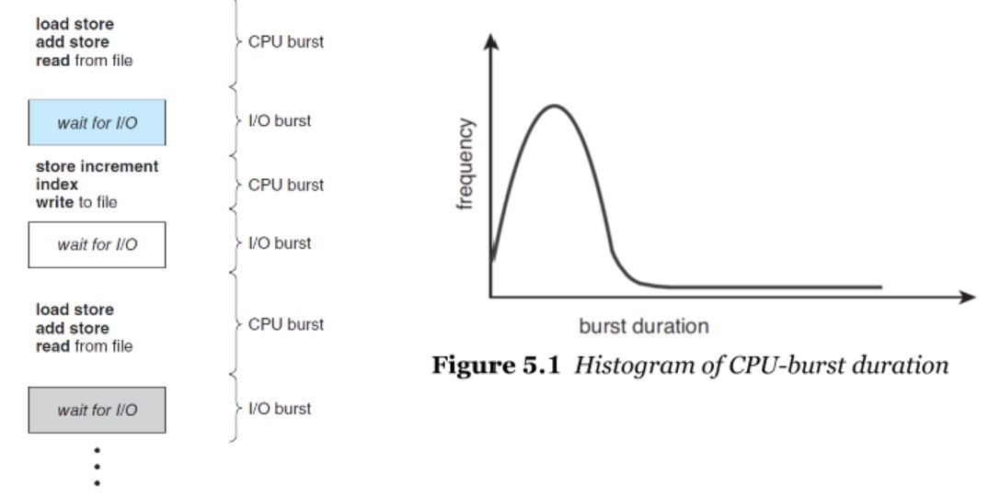

# Chapter 5. CPU Scheduling

# 
#

## 스케쥴링의 목적? 
- CPU에게 일을 최대한 많이 시키자!

### CPU burst보다 I/O burst가 훨씬 높다. I/O burst동안 CPU를 놀리지 않게 하기 위함.

#

## Preemptive vs Non-preemptive
1. preemptive(선점) : 빼앗을 수 있다.
2. non-preemptive(비선점) : 빼앗을 수 없다.

#

## 프로세스의 4가지 동작
1. run -> wait
2. run -> ready
3. wait -> ready (wait -> run은 없다. 반드시 ready를 거쳐야 함)
4. terminate

1, 4 : cpu를 할당받은 프로세스에 의해 자발적으로 수행되는 작업. 즉, non-preemptive일 수 밖에 없다.
2, 3 : p, np 중 하나를 선택하여 수행할 수 있다.

## Roles of Dispatcher
1. 컨텍스트 스위칭 수행 : 스케쥴러는 계획만 하고 실제로 컨텍스트 스위칭을 실행하는 것은 디스패처의 역할
2. 유저모드로 스위칭 : 아래에 이어서
3. jumping to the proper location to resume the user program : 이것도 결국은 컨텍스트 스위칭의 일환

### TMI : User mode / Kernel mode

운영체제에는 유저/커널 두 가지 모드가 존재한다.
두 모드의 역할을 간략하게 나누자면 다음과 같다.

1. User mode : user application 실행. 여러가지 제한사항이 따른다.
2. Kernel mode : OS의 핵심적인 기능들을 모두 수행. 모든 컴퓨팅 자원에 접근 가능. 

각 모드에 대한 설명에 적어놓긴 했지만 이렇게 역할별로 두 모드를 구분한 이유는 컴퓨팅 자원 접근에 제한을 두기 위함이다.
해외 사이트에서 이를 잘 설명해놓은 문구를 긁어왔다.

All of the low level operating system processes run on the kernel level security access, 
but all of the application code and user issued processes run in the application space or the user permission mode. 

#

#### 이해를 돕기 위한 한가지 예시,

모든 애플리케이션 코드는 유저 모드에서 동작한다. 
만약 컴퓨팅 자원들에 치명적인 손상을 입히는 악의적인 로직을 수행하는 애플리케이션을 실수로(or 공격을 받아) 작동시키게 된다면? (ex : 하드디스크를 다 지워버려!)
이러한 불상사를 막기 위해 애플리케이션이 실제로 동작하는 user mode에서는 중요한 자원들에 대한 접근 제한을 둔다.

??? : 근데.. 정상적인 I/O와 악의적인 I/O를 어떻게 구분하지? 정상적인 I/O 요청도 user mode에서는 수행하지 못하니 시스템콜을 통해 kernel mode를 호출해서 수행하도록 할 텐데.. 이 둘을 어떻게 구분..???

여튼, 중요 자원에 접근한 후 다시 애플리케이션을 동작을 수행하기 위해 user mode 로 전환하는 역할을 디스패처가 한다.

#### user / kernel 모드 참고 링크
> https://jhnyang.tistory.com/190
> 
> https://blockdmask.tistory.com/69

Dispatcher latency : The time to stop one process and start another running
> 그냥 컨텍스트 스위칭에 걸리는 시간이라고 봐도 무방할 듯

### 대표적인 스케쥴링 방식
FCFS, SJF(SRTF), RR, MLQ, MLFQ 

각종 계산은 생략. 시험볼것도 아니고..ㅋㅋ

