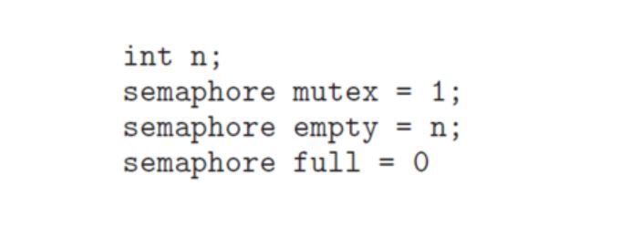
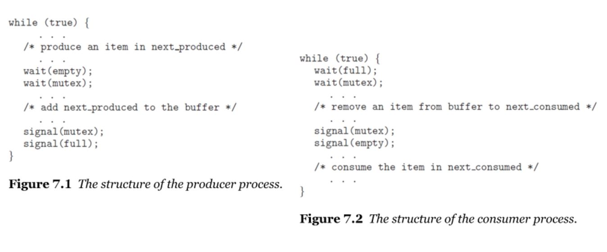
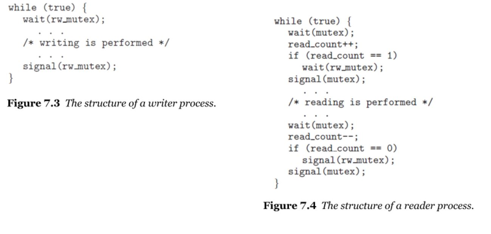
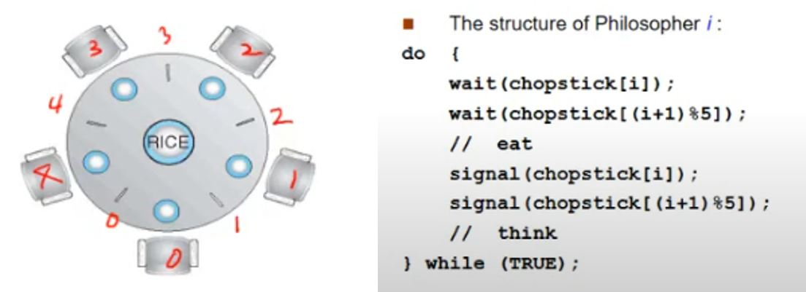
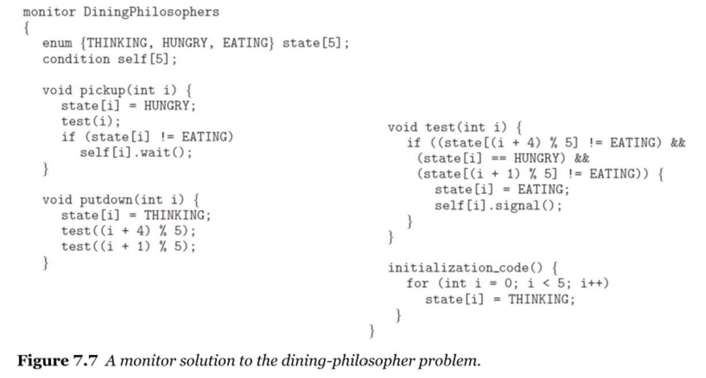

# Synchronization Examples 

1. Bounded-Buffer
2. Readers-Writers
3. Dining-Philosophers

세 경우 모두 상황만 조금씩 다를 뿐 결국 세마포어를 이용한 동기화를 제대로 이해했는지 묻는 문제.

## Bounded-Buffer
한정된 공간(버퍼)을 사용한 producer-consumer 문제

#

총 세 개의 세마포어를 사용한다. mutex는 바이너리 세마포어.
mutex : critical section(버퍼)에 대한 세마포어
full : 사용 가능한 item 수
empty : 버퍼의 빈 칸의 수

#

#
#

## Readers-Writers
두 가지 솔루션(first, second)

동기화 방식에 따로 차이가 있는 것은 아니고 스케쥴링을 어떻게 해줄 것인지에 대한 차이.
1. first : 읽기, 쓰기 동작에 대해 동일한 우선순위를 부여 - 읽기, 쓰기 기아 위험
2. second : 쓰기에 더 높은 우선순위 부여 - 읽기 기아 위험

### 특이점
1. 읽기는 데이터에 영향을 미치지 않으므로 읽기 중간에 읽기를 수행해도 상관 없다. (Race Condition 무시)
2. 쓰기는 데이터에 영양을 미치므로 "쓰기 중 읽기or쓰기" + "읽기 중 쓰기"에 대해서 막아준다. 

rw_mutex, mutex, read_count

mutex : read_count에 대한 바이너리 세마포어
read_count : rw_mutex에 영향을 미침
rw_mutex : 쓰기 연산에 대한 세마포어

#
#
#

## Dining-Philosophers

철학자 : process,
젓가락 : critical section

mutual exclusion 까지는 보장되지만 Deadlock, starvation 위험 존재

데드락 벗어나기 위한 솔루션?
1. 네 명만 앉힌다 - 좀 어거지인 듯
2. 넷만 왼->오,  하나는 오->왼
3. 짝수는 왼->오, 홀수는 오->왼 - 2번이랑 별 다를 바 없는 듯

기아 위험은 없앨 수 없다.

### 모니터 솔루션

??? : 특이점을 잘 인지를 못 하겠다. 그냥 구조체로 감싸놓아서 모니터인 것??

